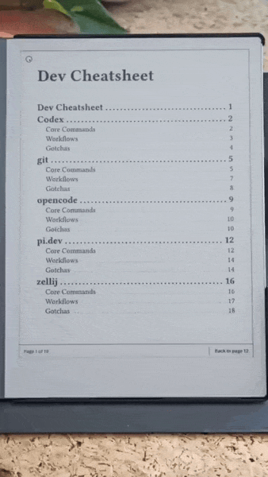

# reMarkable cheatsheet

> **An agent skill for building bookmarked PDF cheatsheets and quick-reference
> guides for the reMarkable tablet.**

The reMarkable is good for long-form reading and writing. It is much less
good at quick lookup: opening a manual, finding the right section then
flipping back again is enough friction that I usually stop doing it

This project turns the tablet into a desktop reference screen. The output is
a bookmarked PDF where **one subject gets one page**. By default commands, keys, or API
calls are placed at the top; workflows in the middle; gotchas near the bottom; and a
blank scratch zone for pen notes

The main interface is the agent skill in
`.agents/skills/cheatsheet/SKILL.md`. You can still run the shell scripts by
hand but the intended workflow is to ask an agent to create, update, build,
preview and optionally sync the cheatsheet for you

[]('assets/readme/usage.gif')

## What it makes

- **Device-tuned PDFs** - presets for reMarkable Paper Pro (180 x 240mm) and
  reMarkable 2 (157 x 209mm), with readable body text
- **Bookmarked subjects** - each sheet becomes a clickable PDF outline entry
- **A generated cover index** - the first page links to the included sheets
- **Return-to-index button** - each page has a small top-right link back to
  the index, so you can jump home without swiping through pages
- **Scratch space** - each page reserves a bottom writing zone for pen notes
- **Agent-guided sheet creation** - the skill asks for scope, sources, preset,
  PDF name, preview and sync choices before editing files
- **Optional preview and sync** - render PNG previews with poppler and upload
  to the reMarkable cloud with `rmapi`

## Use it with an agent

Point your coding agent at this repository and ask it to use the skill file:

```text
Use .agents/skills/cheatsheet/SKILL.md and add a cheatsheet page for Zellij.
Use official docs, keep the existing library PDF, build a preview and do not push
```

If your agent supports slash commands or local skills, invoke the skill
directly:

```text
/cheatsheet
```

For a concrete task, give the subject and sources up front:

```text
/cheatsheet add a sheet for Codex using https://developers.openai.com/codex/
```

The skill guides the agent through these decisions:

- **Focused PDF or library PDF** - include only the new sheet, or keep all
  existing sheets and add the new one
- **Device preset** - Paper Pro default, Paper Pro dense, reMarkable 2
  comfortable, or high contrast
- **Index depth** - sheet titles only, or sheet titles plus section entries.
- **PDF name** - use a suggested content-based name or provide your own
- **Preview** - build one PNG per page for quick inspection
- **Push** - upload to the reMarkable cloud via `rmapi` when configured

## Good agent prompts

```text
Use the cheatsheet skill. Add a Docker Compose sheet from the official docs,
keep the existing sheets, use paper-pro-dense, build with preview and report
the output path and page count
```

```text
Use the cheatsheet skill. Switch this project to rm2-comfortable and show me
a side-by-side preview diff before rebuilding the PDF
```

```text
Use the cheatsheet skill. Build the current library, suggest a better PDF
filename from the included sheets, but ask before changing cheatsheet.toml
```

## Source policy

For new sheets, prefer official documentation or reputable primary sources
The skill should stay conservative: do not invent commands, keybindings, API
details, or game mechanics just to fill a page. If the subject is broad,
narrow it first: for example, `Python packaging` is a better sheet target than
all of `Python`

## Presets

| Preset              | Page      | Body | Scratch | Borders     | When to use                               |
| ------------------- | --------- | ---- | ------- | ----------- | ----------------------------------------- |
| `paper-pro-default` | 180x240mm | 11pt | 40mm    | 0.4pt gray  | Default. Balanced for Paper Pro.          |
| `paper-pro-dense`   | 180x240mm | 10pt | 30mm    | 0.4pt gray  | Fit more commands per page.               |
| `rm2-comfortable`   | 157x209mm | 12pt | 50mm    | 0.4pt gray  | reMarkable 2. Bigger text, more pen room. |
| `high-contrast`     | 180x240mm | 11pt | 40mm    | 0.8pt black | Frontlight / sunlight / low-vision.       |

You can override individual values in `cheatsheet.toml`:

```toml
preset = "paper-pro-default"
scratch_zone_mm = 55
pdf_name = "dev cheatsheet"
index_depth = 1
```

The full config schema is in [`references/config.md`](./references/config.md).

## Manual fallback

If you want to build without an agent:

```bash
echo 'preset = "paper-pro-default"' > cheatsheet.toml
bash scripts/build.sh --preview
```

That writes the PDF to `output/<pdf_name>.pdf` or `output/cheatsheet.pdf` if
no custom `pdf_name` is configured. Preview PNGs go to `output/preview/`

Typst is required. Poppler is only needed for preview images and `rmapi` is
only needed for cloud upload

| Tool                                                                             | Required | Install                                                                                        |
| -------------------------------------------------------------------------------- | -------- | ---------------------------------------------------------------------------------------------- |
| [Typst](https://typst.app) 0.15+                                                 | yes      | `brew install typst` / `cargo install typst-cli` / `winget install Typst.Typst`                |
| [poppler](https://poppler.freedesktop.org/) (for `--preview` and `diff-preview`) | optional | `brew install poppler` / `apt install poppler-utils` / `winget install oschwartz10612.Poppler` |
| [rmapi](https://github.com/ddvk/rmapi) (for `--push`)                            | optional | Go binary; see `references/sync.md` for setup                                                  |

## Syncing to the device (still testing it)

The simplest route is still drag-and-drop: build the PDF and import it through
the reMarkable desktop or web app

If you use `rmapi`, the agent can run:

```bash
bash scripts/build.sh --push
```

Setup details are in [`references/sync.md`](./references/sync.md)

## More detail

- [`.agents/skills/cheatsheet/SKILL.md`](./.agents/skills/cheatsheet/SKILL.md) - the agent skill spec
- [`references/config.md`](./references/config.md) - config keys and types.
- [`references/design-system.md`](./references/design-system.md) - e-ink layout rationale
- [`references/tool-sheet-template.md`](./references/tool-sheet-template.md) - what belongs in each sheet section
